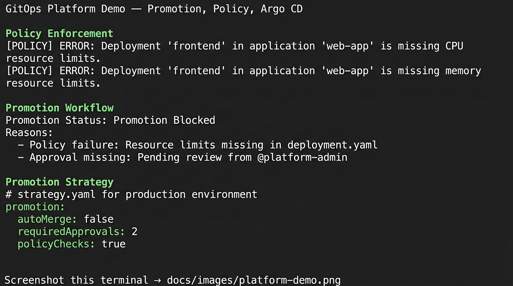

# GitOps Platform

An enterprise GitOps control plane with enforceable promotion workflows, policy-driven controls, and observable deployment behavior — not just infrastructure as code.

---

## Example Platform Run



*Screenshot: Promotion workflow, policy enforcement, Argo CD sync. Add `docs/images/platform-demo.png` when available.*

### Terminal Output: Promotion Blocked

```
Promotion Blocked: FAILED POLICY CHECK
Environment: stage → prod

Reasons:
- Unpinned image
- Missing approval
- Drift detected
```

### What This Proves

- **Policy can block production**
- **Promotion is controlled, not automatic**
- **The platform produces actionable outputs**
- **GitOps runtime drift is part of the control model**

---

## 5-Minute Platform Demo

Golden-path flow using existing scripts:

1. **Validate config**
   ```bash
   ./scripts/validate.sh
   ```

2. **Run policy check**
   ```bash
   ./scripts/policy-check.sh
   # or: python scripts/policy-enforcement-agent.py
   ```

3. **Simulate promotion**
   ```bash
   ./scripts/promote.sh dev stage
   # or: ./scripts/bootstrap.sh
   ```

4. **Inspect promotion result** — observe blocked or approved outcome

5. **Example output (blocked):**
   ```
   ❌ Promotion Blocked
   Reason:
   - Policy failure
   - Approval missing
   ```

6. **Fix issue and re-run promotion**

---

## Platform Workflow (End-to-End)

1. **Developer commits** app config
2. **Hydrator** renders manifests
3. **Argo CD** reconciles desired state
4. **Policy engine** validates changes
5. **Promoter** controls environment progression
6. **Observability** tracks deployments and drift
7. **AI agent** (optional) suggests fixes

---

## What Blocks Promotion to Production

Promotion will fail if:

- Failed policy checks
- Missing manual approval
- Detected drift between Git and cluster
- Artifact mismatch or unverified image

---

## Core Platform Components

| Component | Role | Lifecycle Stage |
|-----------|------|-----------------|
| **Manifest Hydrator** | DRY config → hydrated manifests → Git branches | Pre-sync; produces env-specific manifests |
| **GitOps Promoter** | Promotion between environments; approvals | Post-merge; gates stage→prod |
| **Argo CD** | Sync desired state from Git to clusters | Continuous; reconciliation |
| **Policy Enforcement** | Validate PRs, block promotion on violations | PR validation; promotion gate |
| **Observability** | Deployment timeline, drift, DORA metrics | Post-deploy; visibility |
| **AI Recommendations Tab** | App health, optimizations, fixes in Argo CD UI | Review; remediation hints |

These form **one system** — a GitOps control plane with deterministic promotion workflow, policy enforcement, and visibility.

---

## Promotion Model

Promotion is **controlled**, not automatic. Requirements:

| Requirement | Where Enforced |
|--------------|----------------|
| Successful validation | CI; `validate.sh`, `policy-check.sh` |
| Policy pass | PR gate; promotion gate |
| Approvals | GitOps Promoter (prod `autoMerge: false`) |
| Artifact immutability | Policy (prod must use image digest) |

See [docs/PROMOTION-WORKFLOW.md](docs/PROMOTION-WORKFLOW.md).

---

## Policy Enforcement Example

```yaml
# platform/policies/promotion-policy.yaml
rules:
  - name: require-pinned-images
    description: All container images must be pinned
    severity: high
```

**Sample failure message:**

```
FAIL: image uses 'latest' tag — must be pinned
```

### Additional Rules

| Rule | Purpose |
|------|---------|
| `immutable-artifact` | Production must use image digest |
| `resource-limits` | All containers must have resource limits |

### Where Enforcement Happens

| Stage | Mechanism |
|-------|-----------|
| PR validation | `scripts/policy-check.sh` in CI |
| Promotion gate | Policy engine + GitOps Promoter |

**Integration**: [ai-devsecops-policy-enforcement-agent](https://github.com/example/ai-devsecops-policy-enforcement-agent) can plug in for PR validation and remediation comments. Loosely coupled — integration point, not dependency.

---

## Quick Start

### Quick Start (2 minutes)

```bash
./scripts/validate.sh
./scripts/policy-check.sh
```

Inspect `platform/`, `platform/apps/`, `platform/environments/`. See [docs/example-outputs/](docs/example-outputs/) for expected output.

### Platform Demo (5 minutes)

1. `./scripts/validate.sh`
2. `./scripts/policy-check.sh` or `python scripts/policy-enforcement-agent.py`
3. `./scripts/bootstrap.sh` or `./scripts/promote.sh dev stage`
4. Inspect promotion result (blocked or approved)
5. See [5-Minute Platform Demo](#5-minute-platform-demo) above for full flow

### Deployment (Advanced)

```bash
# Deploy platform components
kubectl apply -f manifest-hydrator/config/
kubectl apply -f gitops-promoter/config/   # See gitops-promoter/config/README.md
kubectl apply -f platform/argo/

# Deploy observability (Grafana dashboards)
./scripts/deploy-observability.sh
```

---

## Platform Consumers

This repo is the **control plane** that governs and promotes application repositories:

- [demo-github-argo-insecure-app](https://github.com/LongTheta/demo-github-argo-insecure-app)
- [demo-gitlab-argo-insecure-app](https://gitlab.com/LongTheta/demo-gitlab-argo-insecure-app)

These application repos define workloads and CI/CD; this platform validates, promotes, and deploys them via Argo CD.

---

## How the Repos Connect

```
Application Repo → Policy Enforcement → GitOps Platform → Argo CD → Cluster
```

- **Application Repo** — defines app code and manifests
- **Policy Enforcement** — `scripts/policy-check.sh`, `scripts/policy-enforcement-agent.py`
- **GitOps Platform** — this repo; promotion workflow, overlays, approvals
- **Argo CD** — syncs desired state to clusters
- **Cluster** — dev, stage, prod namespaces

---

## Observability


*Placeholder: Deployment timeline, drift, DORA metrics. Add `docs/images/observability-dashboard.png` when available.*

The platform provides:

- **Deployment tracking** — timeline, frequency, commit-to-production
- **Drift detection** — cluster state vs Git desired state
- **Promotion visibility** — which changes moved where, when
- **DORA-style metrics** — deployment frequency, lead time, change failure rate, MTTR

| Metric | Purpose |
|--------|---------|
| **Deployment frequency** | How often we ship |
| **Lead time** | Commit → production |
| **Change failure rate** | % deployments causing incidents |
| **MTTR** | Time to recover |
| **Drift detection** | Cluster vs Git |
| **Manual overrides** | Exceptions to GitOps flow |

Dashboards: `observability/dashboards/deployment-intelligence/`. See [docs/OBSERVABILITY.md](docs/OBSERVABILITY.md).

---

## Example Outputs

The platform produces these artifacts. Proof of deterministic, executable behavior.

| Output | Source | Example |
|--------|--------|---------|
| Validation results | `validate.sh` | [docs/example-outputs/validate-success.txt](docs/example-outputs/validate-success.txt) |
| Policy failure | `policy-check.sh` | [docs/example-outputs/policy-check-failure.txt](docs/example-outputs/policy-check-failure.txt) |
| Promotion blocked | GitOps Promoter / policy gate | [docs/example-outputs/promotion-blocked.txt](docs/example-outputs/promotion-blocked.txt) |
| Drift report | Observability | See [docs/example-outputs/README.md](docs/example-outputs/README.md) |

---

## Repository Structure

```
gitops-platform/
├── README.md
├── PRINCIPLES.md
├── docs/
│   ├── images/              # platform-demo.png, observability-dashboard.png
│   ├── example-outputs/     # Validation, policy, promotion outputs
│   ├── ARCHITECTURE.md
│   ├── PROMOTION-WORKFLOW.md
│   ├── POLICY-ENFORCEMENT.md
│   └── ...
├── platform/
│   ├── environments/        # dev, stage, prod
│   ├── apps/                # example-app, backend-service, demo-github-*, demo-gitlab-*
│   ├── argo/                # Projects, Applications (incl. demo app deployments)
│   ├── policies/            # org-baseline, promotion-policy
│   └── self-service/       # Templates, onboarding
├── manifest-hydrator/       # DRY → hydrated
├── gitops-promoter/         # Promotion strategy
├── ai-recommendations-tab/  # Argo CD UI extension + MCP
├── observability/           # Dashboards, Easy Button
├── scripts/                 # validate, policy-check, promote, bootstrap
├── examples/                # insecure, secure, promotion-flow
└── .github/workflows/       # validate.yml
```

---

## How to Onboard an App

1. Copy template from `platform/self-service/templates/app-template/`
2. Add base + overlays (dev, stage, prod)
3. Add Argo CD Application in `platform/argo/applications/`
4. Submit PR → policy check → merge → promotion follows workflow

See [docs/SELF-SERVICE.md](docs/SELF-SERVICE.md).

---

## Documentation

| Doc | Purpose |
|-----|---------|
| [ARCHITECTURE.md](docs/ARCHITECTURE.md) | Platform architecture |
| [PROMOTION-WORKFLOW.md](docs/PROMOTION-WORKFLOW.md) | Promotion between environments |
| [POLICY-ENFORCEMENT.md](docs/POLICY-ENFORCEMENT.md) | Policy checks and blocking |
| [OBSERVABILITY.md](docs/OBSERVABILITY.md) | Metrics and dashboards |
| [SELF-SERVICE.md](docs/SELF-SERVICE.md) | App onboarding |
| [DEMO-FLOW.md](docs/DEMO-FLOW.md) | 3–5 minute demo |
| [PLATFORM-CONSUMERS.md](docs/PLATFORM-CONSUMERS.md) | How app repos are governed |
| [AI-POLICY-INTEGRATION.md](docs/AI-POLICY-INTEGRATION.md) | AI policy agent integration |
| [BRANCH-PROTECTION.md](docs/BRANCH-PROTECTION.md) | Require validation before merge |
| [RUNBOOK.md](docs/RUNBOOK.md) | Emergency procedures |

---

## Federal DevSecOps Alignment

Aligns with GitOps capabilities: CI/CD orchestration, config as code, security scanning, promotion governance, observability, identity/secrets, policy as code. Maps to NIST SP 800-137, AU-2, AU-6, SI-4, CA-7. Per [PRINCIPLES.md](PRINCIPLES.md): use "aligns with," not "certified."

---

## Version

As of March 2026. Argo CD 2.x/3.x, Grafana 11.x, GitOps Promoter v0.24+.
